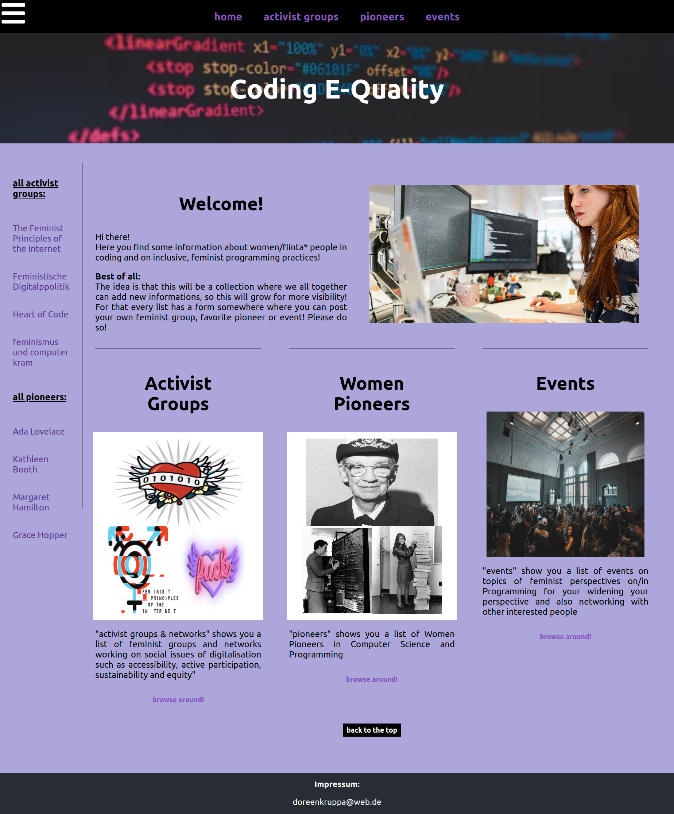
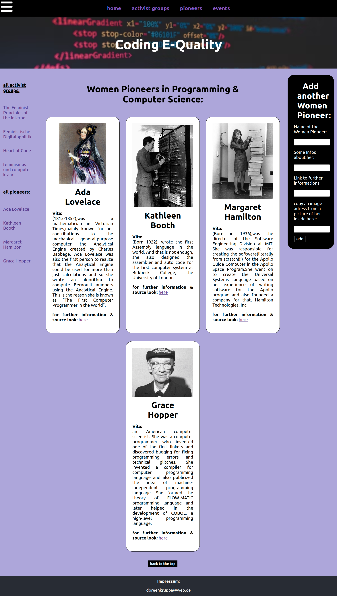
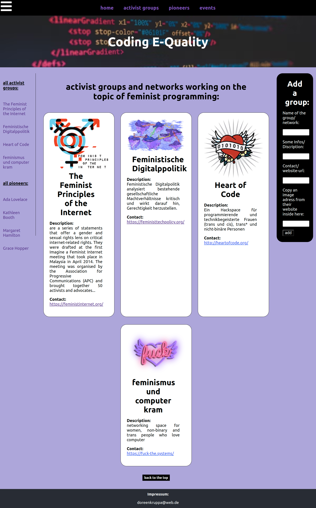
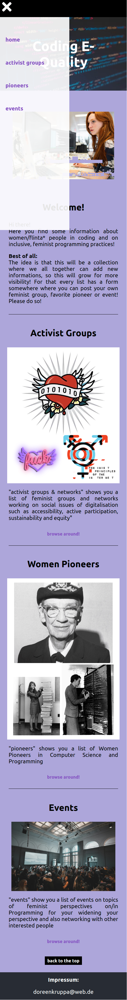
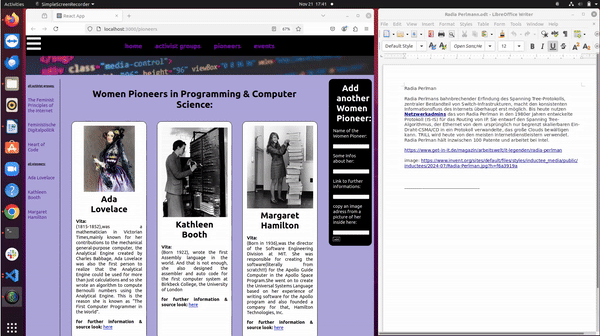
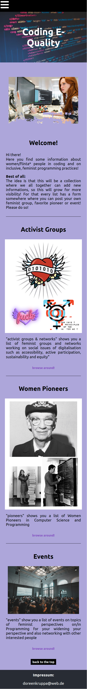
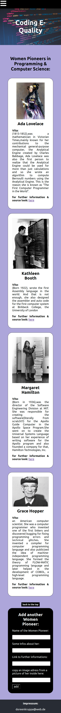
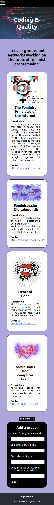

# My final frontend project: React-App "CodingE-Quality"

## Final Project, Course-Module 3,Single Page Application (SPA) - HTML/CSS/JavaScript/React.js

created at 29.3.23;

My App is like a Wiki on topics of inclusive Programming. There are 3 subpages, 1 about women pioneers in coding, 1 about activist groups working on gender equality in IT and 1 about events on similar topics. For each some infos already are given by me but users can also add new Infos via a Form.

For that I created a responsive ReactJS-App using different persistent layout Components and page/feature-specific Components with props, React-Router, fetch, React-Hooks (useState,useContext), EventHandler, media queries and flexbox for responsive Layout, local Storage and useContext-Hook for dynamic behavior and storing data added by user via a form etc....
All the Styling is in one [App.css-File](./src/App.css).

### Structure

Based on a drawing that mapped all planned components and functions, I created a ReactJS app with 3 persistent layout components - [Header](./src/components/Header/Header.js), [Footer](./src/components/Footer/Footer.js) and [Sidebar](./src/components/Sidebar/SidebarCard.js) - and 4 page components - [Home](./src/views/Home.js), [Pioneers](./src/views/Pioneers/PioneersList.js), [Groups](./src/views/Groups/GroupsList.js) and Events.

##### Home-Page

##### Pioneers-Page

##### Groups-Page

The four page components are linked to via NavLinks in [Header](./src/components/Header/Header.js) via dropdown menu (mobile) or Navbar on Top (desktop) and on the home page in the overview of the various subpages via individual short info cards.

#### DropdownMenu Mobile-Version

### Funktionality

While the Home-Page only gives general information of the intention of the App and shows an overview of the other Pages, the other 3 pages (Pioneer-Page, Group-Page, Event-Page) come with functionality.
The main files [PioneersList.js](./src/views/Pioneers/PioneersList.js), [GroupsList.js](./src/views/Groups/GroupsList.js) and EventsList.js each have 2 nested feature-specific components: a [Card-Component](./src/views/Groups/GroupsCard.js) and a [FormComponent](./src/views/Groups/GroupsForm.js), which are each connected with a local data storage by using useState and [useContext](./src/context/GroupsContext.js).
While via Form-Component the user can add data in a specific structure, the Card-Component makes sure, the stored Data is in a specific/ always same layout displayed on the Pioneers-Page or Group-Page or Event-Page.
Via UseContext the Name of every added Data-Komplex is also added to the Sidebar, which is only shown in desktop browsers but hidden in mobile.

#### Demo Functionality

Because this is my final frontend-project and there is no server/database yet the data added by the user are only shown in their own browser. Therefore after the next course modul "backend" for my final fullstack project I will add a server and database to the frontend project so all users can share all the information between each other!

### Responsive Layout

##### Home-Page

##### Pioneers-Page

##### Groups-Page

### Image-Sources

image-sources: Photo by <a href="https://unsplash.com/@wocintechchat?utm_content=creditCopyText&utm_medium=referral&utm_source=unsplash">Christina @ wocintechchat.com</a> on <a href="https://unsplash.com/photos/macbook-pro-2JDDn7iSGH8?utm_content=creditCopyText&utm_medium=referral&utm_source=unsplash">Unsplash</a>

Photo by <a href="https://unsplash.com/@kellysikkema?utm_content=creditCopyText&utm_medium=referral&utm_source=unsplash">Kelly Sikkema</a> on <a href="https://unsplash.com/photos/woman-wearing-black-t-shirt-holding-white-computer-keyboard-YK0HPwWDJ1I?utm_content=creditCopyText&utm_medium=referral&utm_source=unsplash">Unsplash</a>

Photo by <a href="https://unsplash.com/@thisisengineering?utm_content=creditCopyText&utm_medium=referral&utm_source=unsplash">ThisisEngineering</a> on <a href="https://unsplash.com/photos/woman-in-green-shirt-sitting-in-front-of-computer-64YrPKiguAE?utm_content=creditCopyText&utm_medium=referral&utm_source=unsplash">Unsplash</a>

Photo by <a href="https://unsplash.com/@jakobdalbjorn?utm_content=creditCopyText&utm_medium=referral&utm_source=unsplash">Jakob Dalbjörn</a> on <a href="https://unsplash.com/photos/people-inside-conference-cuKJre3nyYc?utm_content=creditCopyText&utm_medium=referral&utm_source=unsplash">Unsplash</a>
